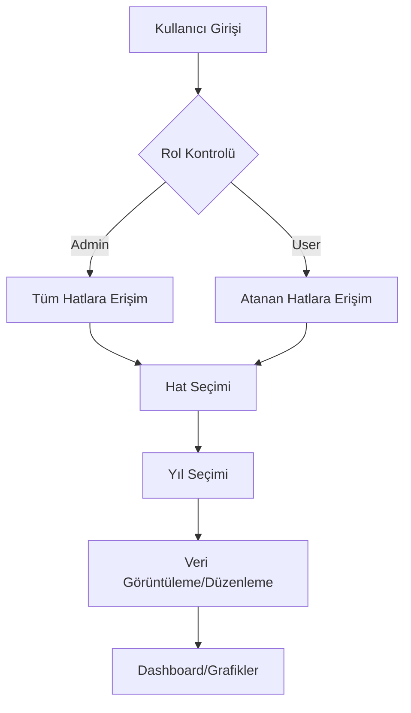

# Sisteme Giriş

## SPS Analiz Sistemi Nedir?

SPS (Standart Parça Sayısı) Analiz Sistemi, üretim hatlarının performansını izlemek ve analiz etmek için geliştirilmiş bir web uygulamasıdır. Sistem, farklı üretim hatlarında üretilen ürünlerin yıllık performans metriklerini takip eder.

## Temel Kavramlar

### 🏭 Hat (Production Line)
Üretim yapılan fiziksel veya mantıksal bir üretim hattı. Örneğin:
- F400
- MC Set
- Okken
- Line 4
- Line 5

### 📦 Ürün (Product)
Bir hatta üretilen ürün. Her ürünün kendine özgü:
- Ürün adı
- Ürün kodu
- Bağlı olduğu hat

### 📊 Yıl Verisi (Year Data)
Bir ürünün belirli bir yıldaki performans metrikleri:
- **KD (Kapsam Dahili)**: Kapsam dahilindeki parça sayısı
- **KE (Kapsam Harici)**: Kapsam harici parça sayısı
- **UT (Ürün Toplam)**: Toplam parça sayısı
- **NVA (Non-Value Added)**: Katma değer katmayan işlemler
- **SPS**: Standart Parça Sayısı (hesaplanan değer)

### 👥 Kullanıcı Rolleri

#### Admin
- Tüm hatlara erişim
- Hat ekleme/silme/düzenleme
- Kullanıcı yönetimi
- Kullanıcılara hat atama
- Tüm verileri görüntüleme ve düzenleme

#### Normal Kullanıcı (User)
- Sadece atanan hatlara erişim
- Atanan hatların verilerini görüntüleme
- Atanan hatların verilerini düzenleme
- Kendi şifresini değiştirme

## Sistem Özellikleri

### ✅ Mevcut Özellikler

1. **Hat Yönetimi**
   - Hat ekleme, düzenleme, silme (Admin)
   - Hat başlık resmi güncelleme
   - Hat bazlı veri organizasyonu

2. **Kullanıcı Yönetimi**
   - Kullanıcı ekleme/silme (Admin)
   - Şifre sıfırlama (Admin)
   - Kullanıcılara hat atama (Admin)
   - Rol bazlı erişim kontrolü

3. **Veri Yönetimi**
   - Ürün ekleme/silme
   - Yıl bazlı veri girişi
   - Toplu veri import (CSV)
   - Veri export (CSV)

4. **Dashboard ve Raporlama**
   - Yıllık performans grafikleri
   - Hat bazlı karşılaştırmalar
   - Ortalama değerler
   - Trend analizi

5. **Güvenlik**
   - JWT tabanlı kimlik doğrulama
   - Rol bazlı yetkilendirme
   - Şifreli parola saklama
   - HTTPS güvenliği

## Sistem Akışı

## Kimler İçin?

### Üretim Müdürleri
- Tüm hatların performansını tek yerden izleme
- Karşılaştırmalı analizler
- Trend takibi

### Hat Sorumlular
- Kendi hatlarının detaylı analizi
- Veri girişi ve güncelleme
- Performans raporları

### Yöneticiler
- Genel performans özeti
- Stratejik kararlar için veri
- Hedef belirleme

## Sonraki Adımlar

- [Hızlı Başlangıç Kılavuzu](./02-hizli-baslangic.md)
- [Admin Kullanıcı Kılavuzu](./04-admin-kilavuzu.md)
- [Normal Kullanıcı Kılavuzu](./05-kullanici-kilavuzu.md)
